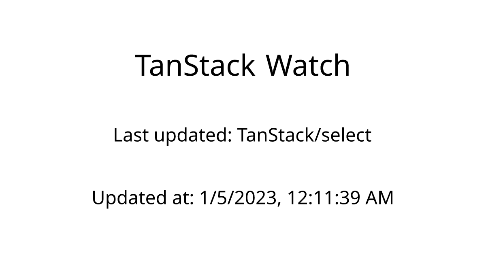
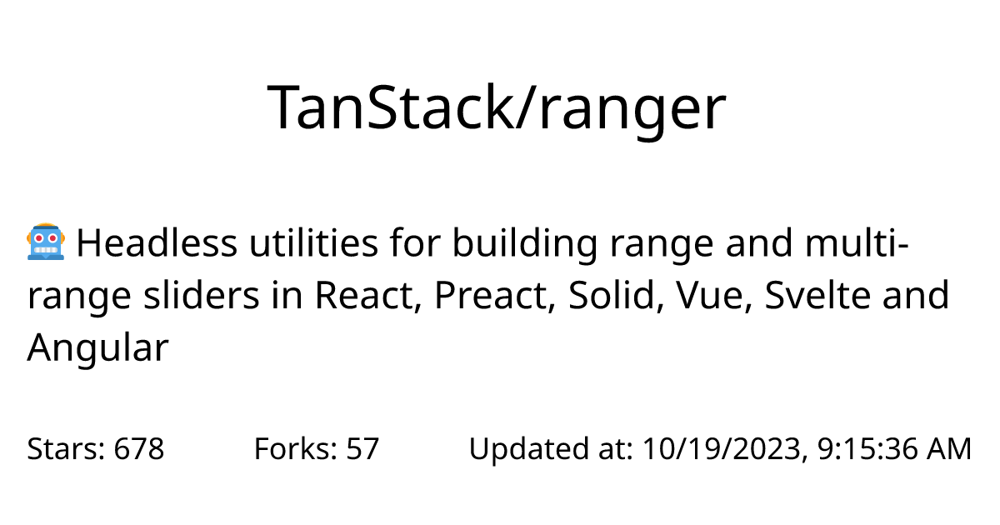

# Task 08 - Metadata

In this task, you will be adding metadata to this Next.js app with generated image previews.

## Requirements

- In `app/layout.tsx`: Add static `metadata` export that sets:
  - `title`: "Tanstack Watch" on home and template "%s | Tanstack Watch"
  - `description`: "Assignment app for practicing Next.js metadata features."
  - `metadataBase`: `new URL(process.env.DEPLOY_URL ?? 'http://localhost:3000')`
- In `app/[repository]/page.tsx` add `generateMetadata` export that fetches current repository and returns its title and description.
- Add `app/opengraph-image.tsx` and `app/[repository]/opengraph-image.tsx`.
- Deploy your solution on Vercel and set `DEPLOY_URL` env variable.

After you deploy your page, you can check if the previews are working correctly on this site:

https://www.opengraph.xyz/

## opengraph-image

The preview images should look something like this. Use `div` and `p` elements for structure. Layout elements with `style` and `display: flex`. You can use `justify-content: space-between; width: 100%` for the bottom info on repository preview and `fontSize: 72` for titles.




Template for `opengraph-image.tsx`:

```tsx
import { ImageResponse } from "next/og";

// Route segment config
export const runtime = "edge";

// Image metadata
export const size = {
  width: 1200,
  height: 630,
};

export const contentType = "image/png";

// Image generation
export default async function Image({
  params, // read [repository] route slug
}: {
  params: { repository: string };
}) {
  // TODO: Fetch data
  return new ImageResponse(
    (
      <div
        style={{
          fontSize: 42,
          background: "white",
          width: "100%",
          height: "100%",
          display: "flex",
          alignItems: "center",
          justifyContent: "center",
          flexDirection: "column",
          padding: 64,
        }}
      >
        {/* TODO: Add content */}
      </div>
    ),
    { ...size }
  );
}
```

**Points:** 1
